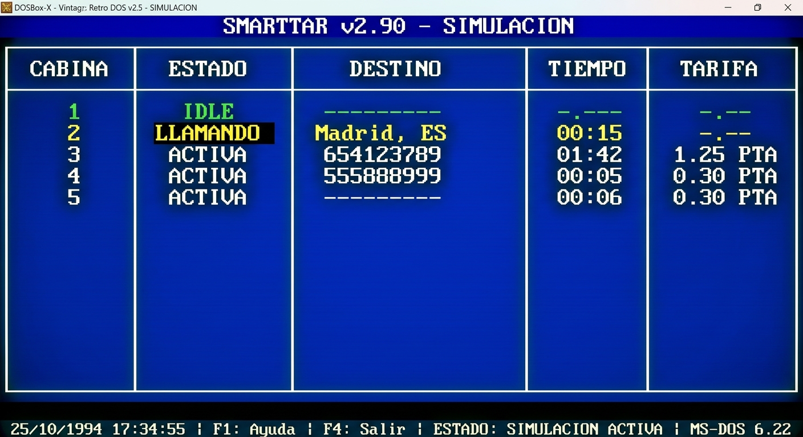

# SmartTar

*Read in [English](README.md).*

Sistema de gesti�n de tarifas telef�nicas en tiempo real para cabinas telef�nicas p�blicas
Desarrollado por [MicroDise�o Ltda.](https://microdiseno.com) � Derechos reservados � 1993?2003 � Versi�n 2.70.1


---

**SmartTar** es un sistema punto de venta para DOS, dise�ado para operadores de
telecomunicaciones en Colombia que administran centros de cabinas telef�nicas.
Monitorea hasta 32 cabinas en tiempo real, clasifica las llamadas por destino,
aplica tarifas seg�n horario (hora del d�a, festivos), imprime recibos con IVA
a trav�s de controladores de impresora enchufables, y mantiene una base de datos
completa de transacciones ? todo desde un �nico ejecutable en modo protegido.

Capacidades principales: medici�n de llamadas en tiempo real, clasificaci�n
autom�tica contra un plan de numeraci�n configurable, motor de tarifas con
calendario de festivos, impresi�n de recibos (18/40/80 col + t�rmica),
almacenamiento indexado de transacciones, soporte de tarjetas magn�ticas
prepagadas, integraci�n con m�dem, displays externos de cabina, m�dulo de
estad�sticas.

El nombre proviene de **Smart + Tar(*ifa*)** ? no tiene relaci�n con Unix `tar`.

---

## Inicio r�pido

**Requisitos:** [DOSBox-X](https://dosbox-x.com/).
```sh
brew install dosbox-x               # macOS
winget install joncampbell123.DOSBox-X   # Windows
```

**Compilar** (dentro de DOSBox-X: `cd ST` luego `makedemo`), o desde el shell del host:
```sh
./build.sh                 # por defecto, demo (sin dongle)
./build.sh --force prod    # variante de producci�n con verificaci�n de dongle
```

La documentaci�n completa est� en [wiki/es/](wiki/es/).
La documentaci�n en ingl�s est� en [wiki/en/](wiki/en/).

---

## Contenido

### Espa�ol ? [wiki/es/](wiki/es/)

- [Gu�a del Usuario](wiki/es/manual-usuario/) ? inicio, monitoreo, informes, contrase�as
- [Manual de Referencia](wiki/es/manual-referencia/) ? arquitectura, configuraci�n, motor de tarifas, interfaz de hardware, recibos
- [Ayuda](wiki/es/ayuda/) ? temas de ayuda de la aplicaci�n (compilados en `help.dat`)

### English ? [wiki/en/](wiki/en/)

- [User Guide](wiki/en/users-guide/) ? starting, monitoring, reports, passwords
- [Reference Manual](wiki/en/reference-manual/) ? architecture, config, tariff engine, hardware interface, receipts
- [In-app Help](wiki/en/help/) ? English help topics (reference only; the application ships in Spanish)

### Documentaci�n de desarrollo ? [wiki/dev/](wiki/dev/)

- [Configuraci�n de DOSBox-X](wiki/dev/dosbox-x-smarttar-setup.md)
- [Notas vol�tiles de ISR](wiki/dev/ISR_VOLATILE_NOTES.md)
- [Flujo de trabajo con Zinc Designer](wiki/dev/zinc-designer-workflow.md)

---

## Cadena de herramientas

SmartTar se compila con Borland C++ 3.1 + Turbo Assembler para el target de
modo protegido Pharlap 286, usando Zinc Interface Library 3.5 para la UI. No
se necesita un compilador en el host ? la compilaci�n se ejecuta dentro de
DOSBox-X.

Los binarios propietarios de la cadena de herramientas est�n en un repositorio
privado separado
(**[`smarttar-vendor`](https://github.com/contento/smarttar-vendor)**), y se
clonan en `vendor/` con `./setup-vendor.sh`. No est�n incluidos en este
repositorio por restricciones de copyright / redistribuci�n. Ver
[VENDOR_SETUP.md](VENDOR_SETUP.md) para detalles.

---

## Variantes de compilaci�n

| Variante | Atajo | Uso |
| -------- | ----- | --- |
| Producci�n | `makeprod` | Build completo con verificaci�n de dongle |
| Demo | `makedemo` | Ferias, evaluaci�n ? sin dongle |
| EDA | `makeeda` | Operador EDA ? clasificaci�n de llamadas distinta |
| Depuraci�n | `makedbg` | Desarrollo; usar con el depurador Pharlap `TDP.EXE` |

---

## Capturas de pantalla

| Versi\u00f3n | Captura |
| ------- | ------- |
| Simulador (mockup) |  |
| 2.33 |  |
| 2.32.1 |  |

---

## Historia

MicroDise�o Ltda. ? la empresa que desarroll� SmartTar ? fue una firma
colombiana de tecnolog�a especializada en sistemas de tarificaci�n y medici�n
telef�nica en el suroccidente de Colombia (Nari�o, Cauca, Putumayo). SmartTar
se despleg� en cabinas telef�nicas comerciales y puntos de venta
institucionales (incluyendo redes *Servicios & Transcripciones* y la
Universidad del Norte). La empresa ya no est� en operaci�n; el c�digo fue
preservado y resucitado en 2026.

---

## Agradecimientos

### Ingenieros

- **Carlos Robledo** ? Director
- **Jorge Martinez** ? Hardware
- **Luis Valencia** ? Hardware
- **Tamayo** ? Hardware
- **Hector Mario Florez** ? Hardware
- **Adriana Giraldo** ? Documentaci�n
- **Gonzalo Contento** ? Ingeniero de Software

---

## Licencia

Derechos reservados � 1993?2003 MicroDise�o Ltda. Todos los derechos reservados.
