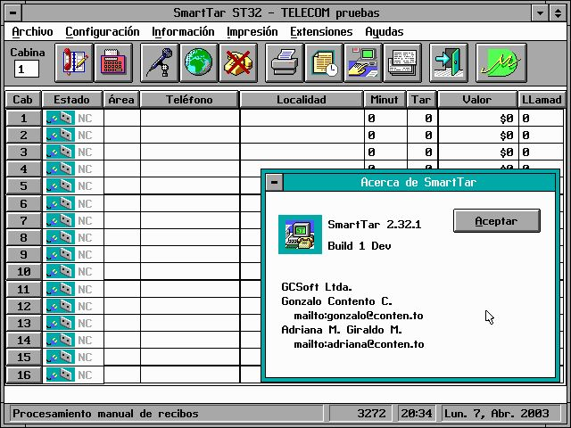

# SmartTar

*Leer en [Español](README.es.md).*

Real-time telephone tariff management system for public telephone booths

Developed by [MicroDiseño Ltda.](https://microdiseno.com) · Copyright © 1993–2003 · Version 2.34



---

## Overview

SmartTar is a DOS-based point-of-sale system designed for Colombian telecommunications operators running public telephone booth centers (*cabinas telefónicas*). It monitors active calls in real time, classifies them by destination, applies the correct tariff schedule, prints itemized receipts with tax, and maintains a full transaction database — all from a single protected-mode DOS executable.

> **About the name** — *SmartTar* = **Smart + Tar(ifa)**. *Tarifa* is the Spanish word for tariff / rate, the standard term in Colombia for telephone call billing. Nothing to do with Unix `tar`.

### Key capabilities

- **Real-time call metering** — monitors up to 32 telephone booths (4 clusters × 8 booths) simultaneously via serial line
- **Automatic call classification** — resolves dialed numbers against a configurable numbering plan tree to determine call type: local, national long-distance (DDN), international (DDI), border, cellular, or special
- **Tariff engine** — applies time-of-day and day-type schedules (up to 16 DDN / 20 DDI tariff bands, 5–6 schedule slots, 3 day types including holidays)
- **Holiday calendar** — configurable per year, used by the tariff scheduler
- **Receipt printing** — issues numbered, tax-inclusive receipts (IVA) through a plug-in printer driver system supporting 18-, 40-, and 80-column printers plus thermal models
- **Transaction database** — indexed file store (`RX.DAT` / `RX.IDX`) with duplicate detection and archiving
- **Prepaid magnetic card support** — up to 4 card denominations
- **Modem integration** — for remote reporting and synchronization
- **External booth display** — optional serial customer-facing display per booth
- **Statistics module** — daily call and revenue summaries
- **Hardware dongle** — copy-protection via parallel-port dongle (bypassable in demo builds)

---

## System Requirements

| Component | Requirement |
| --- | --- |
| OS | MS-DOS 5.0 |
| CPU | 286 or better |
| Memory | Extended memory via Pharlap 286 DOS Extender |
| Printer | Serial or parallel; 18-, 40-, or 80-column |
| Hardware lock | Parallel-port dongle (production builds) |

---

## Toolchain

| Tool | Version |
| --- | --- |
| Compiler | Borland C++ 3.1 (`BCC` / `BCC286`) |
| Assembler | Turbo Assembler (`TASM`) |
| Linker | `TLINK` + Pharlap `BIND286` |
| UI framework | Zinc Interface Library 3.5 |
| DOS extender | Pharlap 286 v3.0 |
| Build system | Borland `MAKE` |

All toolchain binaries are vendored under [`BC/`](BC/), [`PHARLAP/`](PHARLAP/), and [`ZINC/`](ZINC/).

---

## Repository Layout

```text
BC/              Borland C++ 3.1 — compiler, debugger (TD), TASM, TLIB, TLINK
PHARLAP/         Pharlap 286 DOS Extender — BCC286, BIND286, CFIG286, RUN286, runtime DLLs
ZINC/            Zinc Interface Library 3.5 — headers, pre-built libs, GENHELP, DESIGN
dosbox-x.conf    Project-local DOSBox-X config (auto-loaded when launched from repo root)
make-headless.sh Host-side runner (bash); drives a full DOSBox-X build non-interactively
make-headless.ps1 PowerShell Core equivalent for Windows 11
run-headless.sh  Host-side launcher (bash) for st.exe inside DOSBox-X; closes DOSBox-X on exit
run-headless.ps1 PowerShell equivalent for Windows 11
.gitattributes   Enforces CRLF for DOS files, LF for host files
st/              Application
  src/           C++ and C source files, organized by subsystem
                 (ph/, rt/, db/, ui/, mb/, tb/, ct/, ctrl/, pr/)
  include/       Header files
  build/         Object files — intermediate build output (not committed)
  lib/           Static libraries
  bin/           Output binaries and runtime data
  res/           Zinc binary resource source (RES.DAT) — edited via
                 Zinc Designer, copied to bin/ during build
  docs/          User guides, reference manuals, help text, screenshots
  test/          Development test utilities
  util/          Build and maintenance utilities
  MAKEFILE       Borland MAKE build script
  run.bat        Launch st.exe from bin/
  make*.bat      Build-variant shortcuts:
                 makedemo (DEMO + NODONGLE + RUN), makedbg (DEBUG + RUN),
                 makeeda (EDA + RUN), makeauto (AUTO + RUN), makeprod (RUN)
```

---

## Development Environment (DOSBox-X)

The repo ships a project-local [`dosbox-x.conf`](dosbox-x.conf) tuned for the SmartTar target: 386 hardware, DOS 5.0, Pharlap 286 protected mode, 32 MB extended memory, raised DOS file handles for compilation, and a pre-populated `PATH` covering `bc\BIN`, `pharlap\BIN`, and the `util/` subdirectories.

### Install DOSBox-X

| Host | Command |
| --- | --- |
| macOS | `brew install dosbox-x` |
| Windows | `winget install joncampbell123.DOSBox-X` *(or download from [dosbox-x.com](https://dosbox-x.com/))* |

### Launch

Edit the `mount c "..."` lines in [`dosbox-x.conf`](dosbox-x.conf) so the active one points at the project on your host (the Mac and Windows paths are pre-filled — swap which one is commented when moving between hosts). Then:

```sh
cd /path/to/smarttar
dosbox-x
```

DOSBox-X auto-loads `dosbox-x.conf` from the current directory. You will land in `C:\ST` with the toolchain on `PATH`, ready to invoke any of the `make*.bat` shortcuts below or `run` to launch a built executable.

---

## Building

All build commands are run from the `st/` directory inside a DOS 5.0 environment (physical machine, DOSBox-X, or compatible emulator).

### Standard release build

```bat
cd st
make RUN=1
```

`RUN=1` invokes `BIND286` and `CFIG286` after linking to produce a self-contained Pharlap protected-mode executable.

### Build flags

| Flag | Effect |
| --- | --- |
| `RUN=1` | Bind and configure the executable with Pharlap (`BIND286` + `CFIG286`) |
| `DEBUG=1` | Enable debug symbols (`-v`) and linker debug info |
| `DEMO=1` | Define `__DEMO__` — activates demo mode |
| `NODONGLE=1` | Define `__NO_DONGLE__` — skip dongle check (requires `DEMO=1`) |
| `AUTO=1` | Define `__AUTO__` — simulation / auto-pilot mode |
| `EDA=1` | Define `__EDA__` — build variant for EDA operator |
| `HELP=1` | Regenerate `bin/help.dat` from `docs/help.txt` via `genhelp` |

**Demo build (no dongle required):**

```bat
make RUN=1 DEMO=1 NODONGLE=1
```

Or use the shortcut:

```bat
makedemo
```

**Debug build:**

```bat
make DEBUG=1 RUN=1
```

### Headless from the host

[`make-headless.sh`](make-headless.sh) (macOS / Linux / bash) and [`make-headless.ps1`](make-headless.ps1) (Windows 11 / PowerShell Core 7+) drive a complete DOSBox-X build from your host shell without you having to type anything inside DOS:

```sh
# bash (macOS / Linux)
./make-headless.sh                # defaults to demo
./make-headless.sh debug
./make-headless.sh --force prod   # -B (force rebuild) + production variant
./make-headless.sh --keep-log-in-st   # log lands in st/build.log instead of ./build.log
```

```powershell
# PowerShell (Windows 11)
.\make-headless.ps1                # defaults to demo
.\make-headless.ps1 debug
.\make-headless.ps1 prod -Force    # -B (force rebuild) + production variant
.\make-headless.ps1 -KeepLogInSt   # log lands in st\build.log instead of .\build.log
```

Both scripts launch DOSBox-X with `-c "command /c make<variant>.bat HELP=1 …"`, capture all output to `build.log` (streamed live via `tail -F` / `Get-Content -Wait`), wait for DOSBox-X to exit, and report success/failure based on whether the build batch printed `Build succeeded.`. Only one instance can run at a time (DOSBox-X locks its display). Override the DOSBox-X binary location with `DOSBOX_X` (bash env var) or `$env:DOSBOX_X` (PowerShell).

### Launch SmartTar from the host

[`run-headless.sh`](run-headless.sh) and [`run-headless.ps1`](run-headless.ps1) launch the already-built `st/bin/st.exe` inside DOSBox-X and close DOSBox-X automatically when the app exits:

```sh
# bash
./run-headless.sh                 # close DOSBox-X when SmartTar exits
./run-headless.sh --keep-open     # leave the DOS prompt up after exit
./run-headless.sh -- arg1 arg2    # anything after `--` is forwarded to st.exe
```

```powershell
# PowerShell
.\run-headless.ps1
.\run-headless.ps1 -KeepOpen
.\run-headless.ps1 -- arg1 arg2
```

The close-on-exit behavior works because each script queues `-c "exit"` immediately after the `st` invocation, so DOSBox-X exits the instant `st.exe` returns control to `COMMAND.COM`. Build first (`./make-headless.sh ...`) — these scripts only launch, they don't build.

### Output

The build produces:

- `bin/st.exe` — main protected-mode application
- `bin/pr_*.dll` — printer driver DLLs (one per supported printer model)

### Printer driver DLLs

Printer drivers are compiled as Pharlap DLLs from `src/pr/pr_*.c`:

| DLL | Description |
| --- | --- |
| `pr_sr80.dll` | Serial 80-column |
| `pr_dr80.dll` | Parallel 80-column |
| `pr_lin80.dll` | Line printer 80-column |
| `pr_drpre.dll` | Pre-printed forms |
| `pr_dr40.dll` | Parallel 40-column |
| `pr_sr40.dll` | Serial 40-column |
| `pr_dr18.dll` | Parallel 18-column |
| `pr_sr28.dll` | Serial 28-column |
| `pr_dreme.dll` | Thermal REME |
| `pr_drhal.dll` | Thermal HAL |

---

## Configuration

The application is configured through two plain-text files in `bin/`:

### `st.ini`

Operator settings. Generated by the `SETUP` utility. Key sections:

| Section | Settings |
| --- | --- |
| `[Sistema]` | Country, currency, company name, tax rate (IVA), printer port, serial port |
| `[Aplicacion]` | Call floor times, rounding, receipt numbering, display options |
| `[Telefonia]` | Timing parameters — hook detection, DTMF, answer timeout, dial timeout |
| `[Marcacion]` | Access codes, digit counts per call type, access levels |
| `[Extensiones]` | Internal extension line settings |
| `[Valores Criticos]` | Edge-case detection flags |
| `[Modem]` | Modem COM port, baud rate, dial prefix, timeouts |
| `[Display]` | Booth display enable, COM port, baud rate, default message |

### `local.inf`

Local hometown numbering information — maps dialed prefixes to destination city names and call categories for local calls. The sample file covers Antioquia, Colombia (434 entries).

### `bin/ddn.inf`

National long-distance telephony information — numbering plan and tariff data for DDN (domestic) calls.

### `bin/ddi.inf`

International telephony information — numbering plan and tariff data for DDI (international) calls.

`local.inf`, `ddn.inf`, and `ddi.inf` are compiled together by `SETUP` into `bin/ph_info.dat`.

---

## Runtime Data Files

| File | Purpose |
| --- | --- |
| `bin/st.exe` | Main application |
| `bin/st.ini` | Operator configuration |
| `bin/ph_info.dat` | Compiled telephony database (from `ddi.inf` + `ddn.inf` + `local.inf`) |
| `bin/res.dat` | Zinc UI resources |
| `bin/help.dat` | In-application help database |
| `bin/RX.DAT` | Transaction records |
| `bin/RX.IDX` | Transaction index |
| `bin/RX.STA` | Statistics snapshot |
| `bin/LOG.DAT` | System event log |
| `bin/ddi.inf` | International telephony information (source) |
| `bin/ddn.inf` | National long-distance telephony information (source) |
| `bin/local.inf` | Local hometown telephony information (source) |

---

## Architecture

SmartTar is a single-process protected-mode application. The main subsystems are:

```text
┌─────────────────────────────────────────────────────┐
│  Zinc UI layer  (menus, dialogs, toolbar, views)    │
├──────────────┬──────────────────────────────────────┤
│  Controller  │  Real-time engine (rt_eng)           │
│  (control)   │  — per-booth call state machine      │
│              │  — ISR-driven timing (rt_isr)        │
├──────────────┼──────────────────────────────────────┤
│  Tariff      │  Database engine (db_eng / dstorage) │
│  engine      │  — RX.DAT / RX.IDX                   │
│  (ph_eng)    │  — receipt lifecycle                 │
├──────────────┴──────────────────────────────────────┤
│  Serial driver · Print spooler · Dongle · Modem     │
│  Config (cfg) · Logger (log) · Screen saver         │
└─────────────────────────────────────────────────────┘
          Pharlap 286 DOS Extender
          MS-DOS 5.0 / PC hardware
```

### Call lifecycle

1. **Off-hook detected** — serial line signals booth activity; `rt_eng` starts the call timer
2. **Digits captured** — DTMF digits accumulated; `parser` resolves prefix against the numbering plan
3. **Answer detected** — billing starts; tariff rate looked up from `ph_eng` based on call type, time of day, and day type
4. **On-hook detected** — elapsed time computed, final cost calculated (with ceiling/rounding), receipt written to `RX.DAT`
5. **Receipt printed** — spooler dispatches to the active printer driver DLL
6. **Statistics updated** — `dstatist` aggregates daily totals

---

## Build Variants

| Variant | Flags | Shortcut | Use |
| --- | --- | --- | --- |
| Production | `RUN=1` | `makeprod` | Full build with dongle check |
| Demo | `DEMO=1 NODONGLE=1 RUN=1` | `makedemo` | Trade shows, evaluation |
| EDA | `EDA=1 RUN=1` | `makeeda` | EDA operator — different call type classification |
| Debug | `DEBUG=1 RUN=1` | `makedbg` | Development; use with Pharlap `TDP.EXE` debugger |
| Simulation | `AUTO=1 RUN=1` | `makeauto` | Automated test / demo playback |

---

## Screenshots

| Version | Screenshot |
| --- | --- |
| 2.33 |  |
| 2.32.1 |  |

---

## History

MicroDiseño Ltda. — the company that built SmartTar — is no longer in business.

MicroDiseño was a Colombian technology and engineering firm specializing in hardware development, installation, and technical support for telephone billing and metering systems (*sistemas de tarificación telefónica*). Its operations were particularly prominent in southwestern Colombia, including the departments of Nariño, Cauca, and Putumayo.

SmartTar was the company's proprietary information system and hardware platform for managing, metering, and controlling telephone call billing. Its primary deployment footprint included:

- **Commercial call cabins (*cabinas telefónicas*)** — central point-of-sale software and hardware gateway used to track and charge for minutes consumed by customers in commercial call centers.
- **Institutional and retail points of sale** — regional administrative units and commercial networks (such as *Servicios & Transcripciones* networks and academic service hubs like those at Universidad del Norte) used it to manage communication logistics and point-of-sale telephone billing.

The era of dedicated commercial call cabins and localized hardware-based *tarificación* software largely peaked in the late 1990s and 2000s, before cellular and VoIP dominance. As a result, deep technical documentation, source code, and active corporate registries for the platform are absent from modern public web indices. Surviving mentions live within legacy institutional administrative audits, regional career retrospectives of engineers who worked there, and academic infrastructure reports.

---

## License

Copyright © 1993–2003 MicroDiseño Ltda. All rights reserved.
