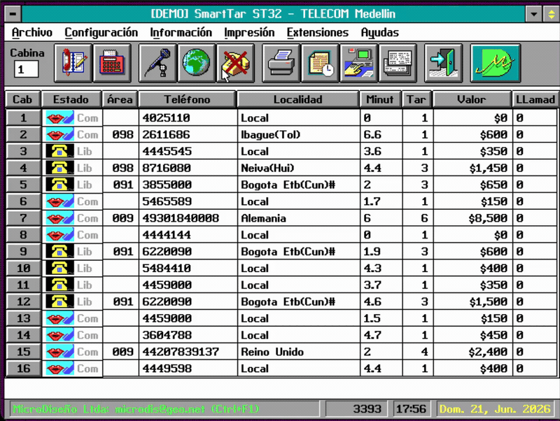

# SmartTar

```text
  o  o
\______/
  |
     |    https://conten.to
--------
```

*Leer en [Español](README.es.md).*

Real-time telephone tariff management system for public telephone booths
Developed by [MicroDiseño Ltda.](https://microdiseno.com) · Copyright © 1993–2003 · Version 2.32.1



---

**SmartTar** is a DOS point-of-sale system for Colombian telephone booth operators
(*cabinas telefónicas*). It monitors up to 32 booths in real time, classifies
calls by destination, applies tariff schedules (time-of-day, holidays), prints
tax-inclusive receipts through plug-in printer drivers, and maintains a full
transaction database — all from a single protected-mode executable.

Key capabilities: real-time call metering, automatic classification against a
configurable numbering plan, tariff engine with holiday calendar, receipt
printing (18/40/80-col + thermal), indexed transaction store, prepaid magnetic
card support, modem integration, external booth displays, statistics module.

The name is **Smart + Tar(*ifa*)** (Spanish for *tariff/rate*), not Unix `tar`.

---

## Quick start

**Prerequisites:** [DOSBox-X](https://dosbox-x.com/).
```sh
brew install dosbox-x               # macOS
winget install joncampbell123.DOSBox-X   # Windows
```

**Set up the vendor toolchain** (required first time):

> **⚠️ Copyright notice:** The build requires proprietary toolchain binaries
> (Borland C++ 3.1, Pharlap 286, Zinc 3.5) that are **not included** in this
> repository due to copyright restrictions. You must obtain these yourself.
> See [VENDOR_SETUP.md](VENDOR_SETUP.md) for manual setup instructions or
> alternative sources.

```sh
./setup-vendor.sh                   # clones proprietary toolchain from private repo
```

**Build** (inside DOSBox-X: `cd ST` then `makedemo`), or from the host shell:
```sh
./build.sh                 # defaults to demo (no dongle required)
./build.sh --force prod    # production variant with dongle check
```

See [wiki/en/](wiki/en/) for the full documentation, or [wiki/es/](wiki/es/)
for the Spanish vault.

---

## Table of contents

### English — [wiki/en/](wiki/en/)

- [User Guide](wiki/en/users-guide/) — starting, monitoring, reports, passwords
- [Reference Manual](wiki/en/reference-manual/) — architecture, config, tariff engine, hardware interface, receipts
- [In-app Help](wiki/en/help/) — English help topics (reference only; the application ships in Spanish)

### Español — [wiki/es/](wiki/es/)

- [Guía del Usuario](wiki/es/manual-usuario/) — inicio, monitoreo, informes, contraseñas
- [Manual de Referencia](wiki/es/manual-referencia/) — arquitectura, configuración, motor de tarifas, interfaz de hardware, recibos
- [Ayuda](wiki/es/ayuda/) — temas de ayuda de la aplicación (compilados en `help.dat`)

### Developer docs — [wiki/dev/](wiki/dev/)

- [DOSBox-X Setup](wiki/dev/dosbox-x-smarttar-setup.md)
- [ISR Volatile Notes](wiki/dev/ISR_VOLATILE_NOTES.md)
- [Zinc Designer Workflow](wiki/dev/zinc-designer-workflow.md)

---

## Toolchain

SmartTar is built with Borland C++ 3.1 + Turbo Assembler for the Pharlap 286
protected-mode target, using the Zinc Interface Library 3.5 for the UI. No host
compiler is needed — the build runs inside DOSBox-X.

The proprietary toolchain binaries live in a separate private repository
(**[`smarttar-vendor`](https://github.com/contento/smarttar-vendor)**) and are
cloned into `vendor/` by `./setup-vendor.sh`. They are not included in this
repository due to copyright / redistribution restrictions. See
[VENDOR_SETUP.md](VENDOR_SETUP.md) for details.

---

## Build variants

| Variant | Shortcut | Use |
| ------- | -------- | --- |
| Production | `makeprod` | Full build with dongle check |
| Demo | `makedemo` | Trade shows, evaluation — no dongle required |
| EDA | `makeeda` | EDA operator — different call type classification |
| Debug | `makedbg` | Development; use with Pharlap `TDP.EXE` debugger |

---

## History

MicroDiseño Ltda. — the company that built SmartTar — was a Colombian
technology firm specializing in telephone billing and metering systems.
SmartTar was deployed in commercial call cabins and institutional points of
sale. The product was maintained for MicroDiseño by **GCSoft**. The company is
no longer in business; the code was preserved and resurrected in 2026.

---

## Acknowledgments


### Engineers

- **Carlos Robledo** — Director, Electronics Engineer
- **Jorge Martinez** — Electronics Engineer
- **Luis Valencia** — Electronics Engineer
- **Hector Tamayo** — Electronics Engineer
- **Mario Florez** — Electronics Engineer
- **Adriana Giraldo** — Documentation, Software Engineer
- **Gonzalo Contento** — Electronics Engineer, Software Engineer

---

## License

Copyright © 1993–2003 MicroDiseño Ltda. All rights reserved.
