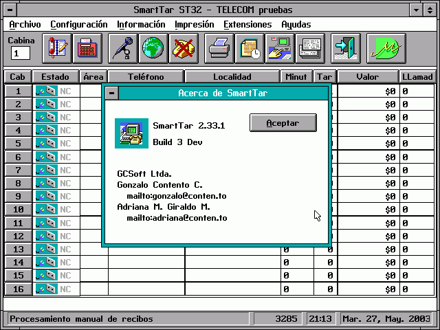

# SmartTar

Sistema de administración de tarifas telefónicas en tiempo real para centros de
cabinas telefónicas. DOS 5.0, modo protegido 286 (Pharlap), Zinc 3.5.
**MicroDiseño Ltda.**

> Este vault es la **fuente única** de la documentación. Los manuales `.docx` y
> la ayuda `help.dat` se **generan** desde estas páginas. Ver [[README]].

## Español

- [[es/index|Documentación en Español]]
- [[es/manual-usuario/index|Guía del Usuario]]
- [[es/manual-referencia/index|Manual de Referencia]]
- [[es/ayuda/index|Ayuda en Línea (temas)]]
- [[es/stc/index|SmartTar Communicator (STC)]]

## English

- [[en/index|Documentation in English]]
- [[en/users-guide/index|User's Guide]]
- [[en/reference-manual/index|Reference Manual]]

## Para mantenedores

- [[README]] — qué genera qué, y cómo construir
- [[CONVENTIONS]] — reglas de edición (frontmatter, codificación, enlaces)
